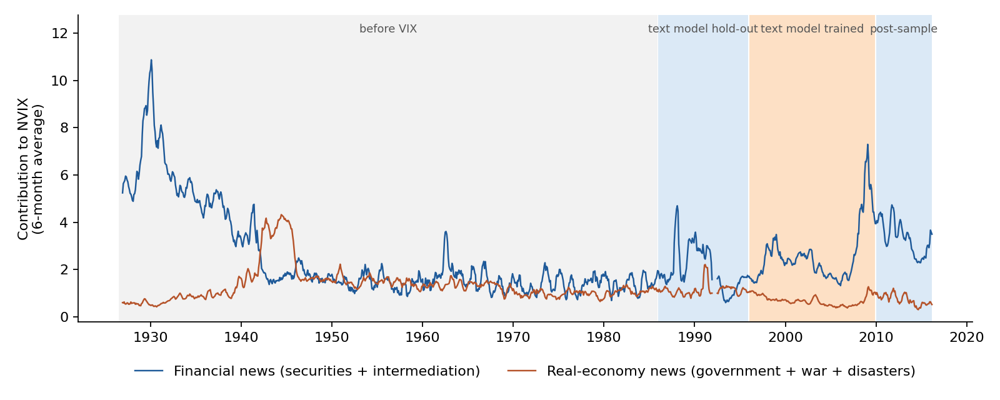
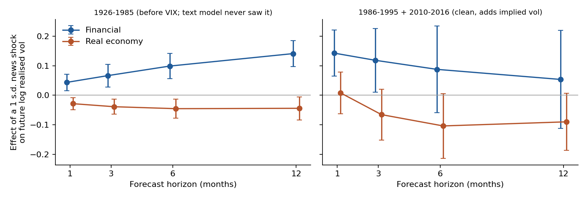
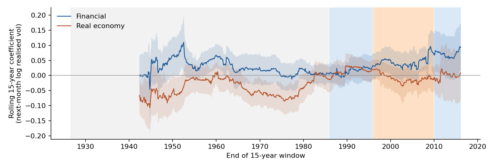
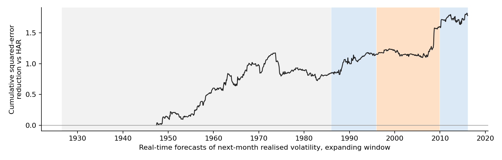

# Which front-page news predicts stock market volatility? 1926 to 2016

Manela and Moreira (2017) built NVIX, a measure of uncertainty read off the front page of the Wall Street Journal back to 1889, and split it into word categories: securities markets, financial intermediation, government, war and natural disasters. This project asks which of those categories carries information about **future** market volatility, and whether option prices already contain it.

The design rests on one fact about how NVIX was made. The text model was **fitted to implied volatility over 1996 to 2009**. Inside that window NVIX is partly a fitted copy of the VIX, so any test that uses those years to predict volatility is contaminated. Everything here is therefore estimated separately on four windows, and the conclusions come from the three the text model never saw.

| Window | Months | What it is | Used for |
|---|---|---|---|
| 1926 to 1985 | 714 | Before the VIX existed; the text model never saw it | Clean test, realised volatility |
| 1986 to 1995 | 120 | The original paper's hold-out sample | Clean test, realised and implied |
| 1996 to 2009 | 168 | The text model's training sample | Reported, never relied on |
| 2010 to 2016 | 75 | Same model applied to new text | Clean test, realised and implied |

The news is grouped into two channels. **Financial**: securities markets plus financial intermediation. **Real economy**: government, war and natural disasters. Regressors are standardised, so each coefficient is the effect of a one standard deviation news shock.



## What I found

**1. Financial news predicts realised volatility that option prices miss.** In the clean modern windows (1986 to 1995 and 2010 to 2016), a one standard deviation rise in financial news predicts next-month realised volatility about 15 percent higher (coefficient 0.143 on log volatility, t = 3.6). That holds after controlling for the VIX itself and for three horizons of past realised volatility, so the information is not already in option prices. It survives adding past returns (t = 3.1) and 24 Newey-West lags (t = 4.2). The effect fades by six months.

**2. The options market under-reacts, so the variance risk premium falls.** In the same clean windows, high financial news predicts a *lower* variance risk premium next month (t = -2.5). Realised variance rises by more than implied variance does, which is what under-reaction looks like.

**3. Before the VIX existed, the same channel predicts realised volatility from 1926 to 1985, but the result is concentrated in 1926 to 1945.** Over the full 60 years the effect grows with horizon, from t = 3.1 at one month to t = 6.3 at twelve, and survives controls for the leverage effect. Dropping the Depression and the war, 1946 to 1985 alone shows nothing (t = 1.4 at one month, -0.2 at twelve). The rolling estimates below show the channel switching on in turbulent financial eras and off in the calm post-war decades.

**4. Government news predicts *lower* volatility, and that is the most robust pre-1986 result.** The real-economy channel enters negatively from 1926 to 1985 at every horizon (t between -2.2 and -3.0) and stays negative after 1946 (t = -3.7). Splitting it into single categories, the effect is carried by **government** news (t = -3.4 to -4.1, Holm-adjusted p at most 0.009 across 15 tests); war and disasters contribute nothing. It does not carry over to the post-1986 windows.





**5. The news helps in real time.** Forecasting next-month realised volatility month by month from 1946, re-estimating on an expanding window with only data available at the time, adding the two news channels to a HAR benchmark (Corsi 2009) reduces squared forecast error by 2.1 percent (Clark-West t = 4.0). The gain is positive in every window: 1.8 percent before the VIX (p = 0.003), 2.1 percent in the 1986 to 1995 hold-out (p = 0.015) and 1.8 percent after 2010 (p = 0.056). The jump in 2008 falls inside the training window and should be discounted.



**6. A correction to my own earlier result.** My first pass at this, in September 2026, found the financial channel about 60 percent stronger after 2008. That comparison used 2008 to 2009, which sit inside the text model's training sample. Comparing only windows the model never saw, there is no evidence of a break: the post-2010 interaction is -0.01 (t = -0.1) for realised volatility and 0.03 (t = 0.7) for implied.

The original implied-volatility test is also weaker than it first looked. Next-month changes in the VIX respond to financial news with t = 2.0 in the pooled clean windows, t = 3.1 after 2010 and t = 1.6 in 1986 to 1995, and not at all in the training window (t = 0.6). Realised volatility, not implied, is where the signal is clearest.

## What this does not show

- **NVIX is not point in time.** Its word weights were learned from 1996 to 2009 text, so the 1926 to 1985 values use knowledge of later language. That is not leakage of the outcome, since the weights never saw pre-1986 volatility, but a reader in 1950 could not have computed this series. A chronologically consistent rebuild, re-estimating the text model on an expanding window from the published n-gram counts, is the obvious next step.
- **The modern clean sample is short.** 193 months, of which 75 are after 2010. The post-2010 estimates have wide intervals.
- **The data end in March 2016**, when the published NVIX series stops.
- **Specifications tried: 35**, all logged in `results/spec_registry.csv`. The headline numbers are not the best of many variants; the category tests are Holm-adjusted.

## Method details

- **Realised volatility**: annualised from daily CRSP value-weighted market returns (Kenneth French data library), one month at a time, in logs. Multi-month targets average variance over the next *h* months before taking the square root.
- **Implied volatility**: end-of-month VXO from 1986 (the series NVIX was trained on), VIX where VXO is missing.
- **Variance risk premium**: implied variance minus past-month realised variance (Bollerslev, Tauchen and Zhou 2009 timing).
- **Controls**: HAR terms in log realised volatility at 1, 3 and 12 months; log implied volatility where it exists; past returns and negative past returns for the leverage effect.
- **Inference**: Newey-West standard errors with lags of at least 6 months and at least twice the forecast horizon; Clark and West (2007) for nested out-of-sample comparisons.

## Reproduce

```bash
pip install -r requirements.txt
python src/download.py      # fetches the four public data files into data/raw
python src/build_panel.py   # monthly panel, data/panel_monthly.csv
python src/analysis.py      # every table in results/, plus the specification registry
python src/figures.py       # figures/
```

Runs in under a minute on a laptop. Raw data are not redistributed; `download.py` fetches them from the original sources.

## Results files

| File | Question |
|---|---|
| `q1_quantity.csv` | Does news predict realised volatility, by window and horizon? |
| `q2_implied.csv` | Does news predict changes in implied volatility? |
| `q3_price.csv` | Does news predict the variance risk premium? |
| `q4_categories.csv` | Which single category carries each channel? Holm-adjusted |
| `q5_break.csv` | Did the financial channel change after 2008, on clean data only? |
| `q6_oos.csv`, `oos_forecasts.csv` | Real-time forecasting against HAR |
| `q7_robust.csv` | Leverage effect, post-1946 sample, total NVIX, heavy HAC lags |
| `rolling_coefficients.csv` | 15-year rolling estimates |
| `spec_registry.csv` | Every specification estimated |

## References

- Manela, A. and Moreira, A. (2017). News implied volatility and disaster concerns. *Journal of Financial Economics* 123(1), 137 to 162.
- Corsi, F. (2009). A simple approximate long-memory model of realized volatility. *Journal of Financial Econometrics* 7(2), 174 to 196.
- Bollerslev, T., Tauchen, G. and Zhou, H. (2009). Expected stock returns and variance risk premia. *Review of Financial Studies* 22(11), 4463 to 4492.
- Clark, T. and West, K. (2007). Approximately normal tests for equal predictive accuracy in nested models. *Journal of Econometrics* 138(1), 291 to 311.
- He, S., Lv, B., Manela, A. and Wu, J. (2025). Chronologically consistent large language models. arXiv 2502.21206.

Data: NVIX from Asaf Manela's data page, free for non-commercial use. VIX and VXO from FRED. Market returns from the Kenneth French data library. Code is MIT licensed.

Aakash Bansal, 2026.
